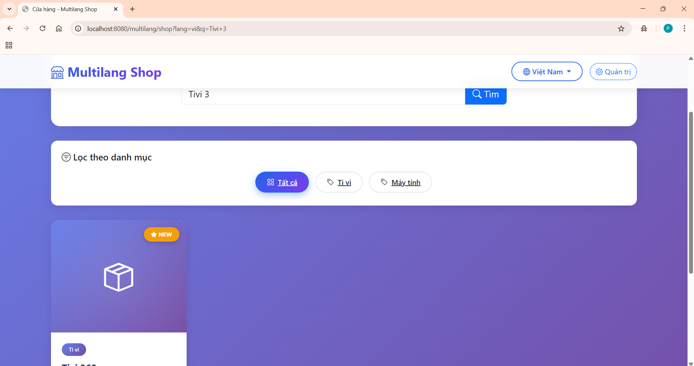
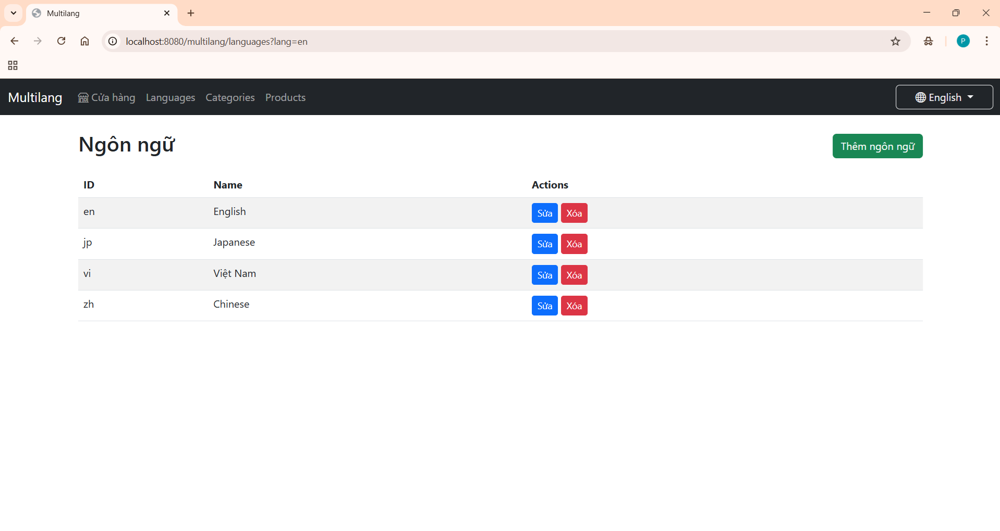
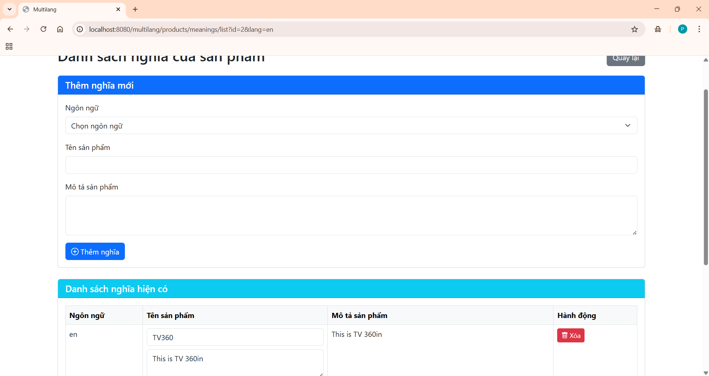
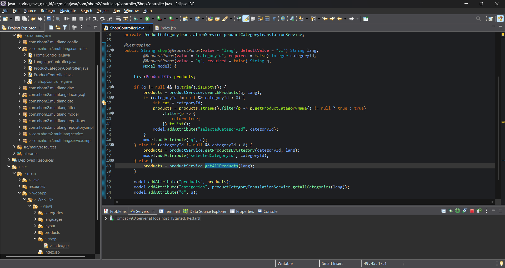
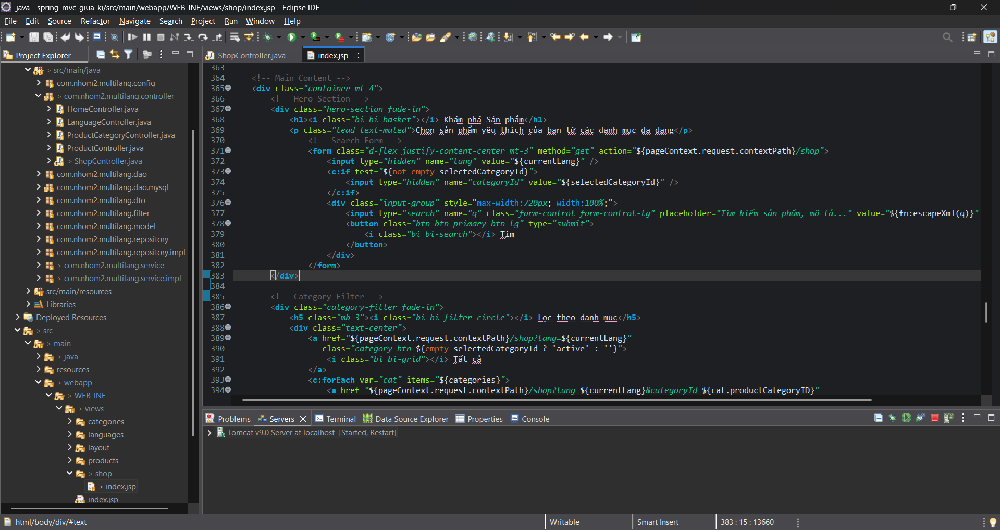

# Screenshot

- Giao diện trang tìm kiếm
-
- Giao diện ngôn ngữ mới




- Ảnh ide




---

## Yêu cầu hệ thống

### Phần mềm cần cài đặt

1. **JDK 17 hoặc cao hơn**
   - Download: https://www.oracle.com/java/technologies/downloads/
   - Hoặc OpenJDK: https://adoptium.net/

2. **Apache Tomcat 10.x**
   - Download: https://tomcat.apache.org/download-10.cgi
   - Lưu ý: Phải dùng Tomcat 10+ (hỗ trợ Jakarta EE)

3. **MySQL 8.0+**
   - Download: https://dev.mysql.com/downloads/mysql/
   - Hoặc XAMPP/WAMP/MAMP

4. **Maven 3.6+**
   - Download: https://maven.apache.org/download.cgi
   - Hoặc dùng Maven wrapper có sẵn trong project

5. **IDE (Khuyến nghị)**
   - IntelliJ IDEA (Community/Ultimate)
   - Eclipse IDE for Enterprise Java
   - VS Code + Extension Pack for Java

---

## Cài đặt

### Bước 1: Clone Repository

```bash
git clone https://github.com/phandinhphu/spring_mvc_giua_ki.git
cd spring_mvc_giua_ki
```

### Bước 2: Cấu hình Database

#### 2.1. Tạo Database

Mở MySQL Workbench hoặc command line:

```sql
CREATE DATABASE multilang_db CHARACTER SET utf8mb4 COLLATE utf8mb4_unicode_ci;
USE multilang_db;
```

#### 2.2. Tạo các bảng

**Bảng Language (Ngôn ngữ):**
```sql
CREATE TABLE language (
    languageID VARCHAR(10) PRIMARY KEY,
    languageName VARCHAR(100) NOT NULL
);

-- Dữ liệu mẫu
INSERT INTO language (languageID, languageName) VALUES
('en', 'English'),
('vi', 'Tiếng Việt'),
('zh', '中文'),
('ja', '日本語'),
('ko', '한국어');
```

**Bảng ProductCategory (Danh mục sản phẩm):**
```sql
CREATE TABLE productcategory (
    productCategoryID INT AUTO_INCREMENT PRIMARY KEY,
    canBeShipped BOOLEAN DEFAULT TRUE
);

-- Dữ liệu mẫu
INSERT INTO productcategory (canBeShipped) VALUES
(TRUE),  -- ID: 1
(TRUE),  -- ID: 2
(FALSE); -- ID: 3
```

**Bảng ProductCategoryTranslation (Nghĩa danh mục):**
```sql
CREATE TABLE productcategorytranslation (
    productCategoryID INT,
    languageID VARCHAR(10),
    categoryName VARCHAR(255) NOT NULL,
    PRIMARY KEY (productCategoryID, languageID),
    FOREIGN KEY (productCategoryID) REFERENCES productcategory(productCategoryID) ON DELETE CASCADE,
    FOREIGN KEY (languageID) REFERENCES language(languageID) ON DELETE CASCADE
);

-- Dữ liệu mẫu
INSERT INTO productcategorytranslation (productCategoryID, languageID, categoryName) VALUES
(1, 'vi', 'Điện tử'),
(1, 'en', 'Electronics'),
(1, 'zh', '电子产品'),
(2, 'vi', 'Quần áo'),
(2, 'en', 'Clothing'),
(3, 'vi', 'Thực phẩm'),
(3, 'en', 'Food');
```

**Bảng Product (Sản phẩm):**
```sql
CREATE TABLE product (
    productID INT AUTO_INCREMENT PRIMARY KEY,
    price DECIMAL(15, 2) NOT NULL,
    weight DECIMAL(10, 2),
    productCategoryID INT,
    FOREIGN KEY (productCategoryID) REFERENCES productcategory(productCategoryID) ON DELETE SET NULL
);

-- Dữ liệu mẫu
INSERT INTO product (price, weight, productCategoryID) VALUES
(15000000, 2.5, 1),  -- Laptop
(500000, 0.3, 2),    -- Áo sơ mi
(50000, 0.5, 3);     -- Bánh mì
```

**Bảng ProductTranslation (Nghĩa sản phẩm):**
```sql
CREATE TABLE producttranslation (
    productID INT,
    languageID VARCHAR(10),
    productName VARCHAR(255) NOT NULL,
    productDescription TEXT,
    PRIMARY KEY (productID, languageID),
    FOREIGN KEY (productID) REFERENCES product(productID) ON DELETE CASCADE,
    FOREIGN KEY (languageID) REFERENCES language(languageID) ON DELETE CASCADE
);

-- Dữ liệu mẫu
INSERT INTO producttranslation (productID, languageID, productName, productDescription) VALUES
(1, 'vi', 'Laptop Dell Inspiron 15', 'Laptop hiệu năng cao, phù hợp cho công việc và học tập'),
(1, 'en', 'Dell Inspiron 15 Laptop', 'High performance laptop, suitable for work and study'),
(2, 'vi', 'Áo sơ mi nam cao cấp', 'Áo sơ mi vải cotton, thoáng mát, phù hợp đi làm'),
(2, 'en', 'Premium Men Shirt', 'Cotton shirt, breathable, suitable for office'),
(3, 'vi', 'Bánh mì Việt Nam', 'Bánh mì giòn ngon, nhân thịt pate'),
(3, 'en', 'Vietnamese Bread', 'Crispy bread with meat and pate filling');
```

#### 2.3. Cấu hình kết nối Database

Mở file `src/main/resources/db.properties`:

```properties
# MySQL Database Configuration
db.driver=com.mysql.cj.jdbc.Driver
db.url=jdbc:mysql://localhost:3306/multilang_db?useSSL=false&serverTimezone=UTC&allowPublicKeyRetrieval=true
db.username=root
db.password=YOUR_PASSWORD_HERE

# HikariCP Configuration
hikari.maximumPoolSize=10
hikari.minimumIdle=5
hikari.connectionTimeout=30000
hikari.idleTimeout=600000
hikari.maxLifetime=1800000
```

**Quan trọng:** Thay `YOUR_PASSWORD_HERE` bằng password MySQL của bạn!

### Bước 3: Build Project

```bash
# Sử dụng Maven
mvn clean install

# Hoặc sử dụng Maven Wrapper (khuyến nghị)
./mvnw clean install   # Linux/Mac
mvnw.cmd clean install # Windows
```

### Bước 4: Deploy lên Tomcat

#### Cách 1: Sử dụng IDE (Khuyến nghị)

**IntelliJ IDEA:**
1. File → Project Structure → Artifacts
2. Add → Web Application: Exploded → From Modules
3. Run → Edit Configurations → Add Tomcat Server → Local
4. Deployment tab → Add → Artifact → chọn artifact vừa tạo
5. Click Run

**Eclipse:**
1. Right-click project → Properties → Targeted Runtimes
2. Check Apache Tomcat 10.x
3. Right-click project → Run As → Run on Server
4. Select Tomcat server → Finish

#### Cách 2: Deploy thủ công

```bash
# Build WAR file
mvn clean package

# Copy WAR file vào Tomcat
cp target/multilang.war /path/to/tomcat/webapps/

# Start Tomcat
cd /path/to/tomcat/bin
./catalina.sh run    # Linux/Mac
catalina.bat run     # Windows
```

### Bước 5: Truy cập ứng dụng

- **Homepage**: http://localhost:8080/multilang/
- **Cửa hàng**: http://localhost:8080/multilang/shop?lang=vi
- **Admin - Languages**: http://localhost:8080/multilang/languages
- **Admin - Categories**: http://localhost:8080/multilang/categories?lang=vi
- **Admin - Products**: http://localhost:8080/multilang/products?lang=vi

---

## 🗄️ Cấu trúc Database

### ERD (Entity Relationship Diagram)

```
┌─────────────────┐
│   language      │
├─────────────────┤
│ languageID (PK) │
│ languageName    │
└────────┬────────┘
         │
         │ 1:N
         │
         ├──────────────────────────────────┐
         │                                  │
         │                                  │
┌────────┴──────────────────┐      ┌───────┴─────────────────┐
│ productcategorytranslation│      │  producttranslation     │
├───────────────────────────┤      ├─────────────────────────┤
│ productCategoryID (PK,FK) │      │ productID (PK,FK)       │
│ languageID (PK,FK)        │      │ languageID (PK,FK)      │
│ categoryName              │      │ productName             │
└────────┬──────────────────┘      │ productDescription      │
         │                         └────────┬────────────────┘
         │ N:1                              │ N:1
         │                                  │
┌────────┴────────────┐            ┌────────┴────────────┐
│  productcategory    │            │     product         │
├─────────────────────┤            ├─────────────────────┤
│ productCategoryID(PK)│           │ productID (PK)      │
│ canBeShipped        │            │ price               │
└─────────────────────┘            │ weight              │
         │ 1:N                     │ productCategoryID(FK)│
         └─────────────────────────┴─────────────────────┘
```

### Giải thích các bảng

#### 1. `language` - Ngôn ngữ
Lưu trữ các ngôn ngữ được hỗ trợ trong hệ thống.

| Cột | Kiểu | Mô tả |
|-----|------|-------|
| `languageID` | VARCHAR(10) | Mã ngôn ngữ (vi, en, zh...) - Primary Key |
| `languageName` | VARCHAR(100) | Tên ngôn ngữ hiển thị |

#### 2. `productcategory` - Danh mục sản phẩm
Lưu thông tin cơ bản của danh mục (không phụ thuộc ngôn ngữ).

| Cột | Kiểu | Mô tả |
|-----|------|-------|
| `productCategoryID` | INT | ID danh mục - Primary Key (Auto Increment) |
| `canBeShipped` | BOOLEAN | Có thể vận chuyển không |

#### 3. `productcategorytranslation` - Nghĩa danh mục
Lưu tên danh mục theo từng ngôn ngữ.

| Cột | Kiểu | Mô tả |
|-----|------|-------|
| `productCategoryID` | INT | ID danh mục - Foreign Key |
| `languageID` | VARCHAR(10) | Mã ngôn ngữ - Foreign Key |
| `categoryName` | VARCHAR(255) | Tên danh mục theo ngôn ngữ |

**Composite Primary Key**: (`productCategoryID`, `languageID`)

#### 4. `product` - Sản phẩm
Lưu thông tin cơ bản của sản phẩm (không phụ thuộc ngôn ngữ).

| Cột | Kiểu | Mô tả |
|-----|------|-------|
| `productID` | INT | ID sản phẩm - Primary Key (Auto Increment) |
| `price` | DECIMAL(15,2) | Giá sản phẩm |
| `weight` | DECIMAL(10,2) | Trọng lượng (kg) |
| `productCategoryID` | INT | ID danh mục - Foreign Key |

#### 5. `producttranslation` - Nghĩa sản phẩm
Lưu tên và mô tả sản phẩm theo từng ngôn ngữ.

| Cột | Kiểu | Mô tả |
|-----|------|-------|
| `productID` | INT | ID sản phẩm - Foreign Key |
| `languageID` | VARCHAR(10) | Mã ngôn ngữ - Foreign Key |
| `productName` | VARCHAR(255) | Tên sản phẩm theo ngôn ngữ |
| `productDescription` | TEXT | Mô tả sản phẩm |

**Composite Primary Key**: (`productID`, `languageID`)

---

## Cấu trúc dự án

```
multilang/
├── src/
│   ├── main/
│   │   ├── java/
│   │   │   └── com/
│   │   │       └── nhom2/
│   │   │           └── multilang/
│   │   │               ├── config/              # Cấu hình Spring
│   │   │               │   ├── WebApplication.java
│   │   │               │   ├── WebConfig.java
│   │   │               │   └── GlobalControllerAdvice.java
│   │   │               │
│   │   │               ├── controller/          # Controllers (MVC)
│   │   │               │   ├── HomeController.java
│   │   │               │   ├── ShopController.java
│   │   │               │   ├── LanguageController.java
│   │   │               │   ├── ProductCategoryController.java
│   │   │               │   └── ProductController.java
│   │   │               │
│   │   │               ├── dao/                 # Data Access Objects
│   │   │               │   ├── LanguageDAO.java
│   │   │               │   ├── ProductCategoryDAO.java
│   │   │               │   ├── ProductCategoryTranslationDAO.java
│   │   │               │   ├── ProductDAO.java
│   │   │               │   └── ProductTranslationDAO.java
│   │   │               │
│   │   │               ├── dto/                 # Data Transfer Objects
│   │   │               │   ├── ProductCategoryDTO.java
│   │   │               │   ├── ProductDTO.java
│   │   │               │   └── CreateProductDTO.java
│   │   │               │
│   │   │               ├── filter/              # Servlet Filters
│   │   │               │   └── LanguageFilter.java
│   │   │               │
│   │   │               ├── model/               # Entity Models
│   │   │               │   ├── Language.java
│   │   │               │   ├── ProductCategory.java
│   │   │               │   ├── ProductCategoryTranslation.java
│   │   │               │   ├── Product.java
│   │   │               │   └── ProductTranslation.java
│   │   │               │
│   │   │               ├── repository/          # Repository Layer
│   │   │               │   ├── LanguageRepository.java
│   │   │               │   ├── ProductCategoryRepository.java
│   │   │               │   ├── ProductCategoryTranslationRepository.java
│   │   │               │   ├── ProductRepository.java
│   │   │               │   ├── ProductTranslationRepository.java
│   │   │               │   └── impl/            # Implementations
│   │   │               │       ├── LanguageRepositoryImpl.java
│   │   │               │       ├── ProductCategoryRepositoryImpl.java
│   │   │               │       ├── ProductCategoryTranslationRepositoryImpl.java
│   │   │               │       ├── ProductRepositoryImpl.java
│   │   │               │       └── ProductTranslationRepositoryImpl.java
│   │   │               │
│   │   │               └── service/             # Business Logic Layer
│   │   │                   ├── LanguageService.java
│   │   │                   ├── ProductCategoryService.java
│   │   │                   ├── ProductCategoryTranslationService.java
│   │   │                   ├── ProductService.java
│   │   │                   ├── ProductTranslationService.java
│   │   │                   └── impl/            # Implementations
│   │   │                       ├── LanguageServiceImpl.java
│   │   │                       ├── ProductCategoryServiceImpl.java
│   │   │                       ├── ProductCategoryTranslationServiceImpl.java
│   │   │                       ├── ProductServiceImpl.java
│   │   │                       └── ProductTranslationServiceImpl.java
│   │   │
│   │   ├── resources/
│   │   │   └── db.properties                    # Database config
│   │   │
│   │   └── webapp/
│   │       └── WEB-INF/
│   │           └── views/
│   │               ├── layout/                  # Layout components
│   │               │   ├── header.jsp
│   │               │   └── footer.jsp
│   │               │
│   │               ├── categories/              # Category views
│   │               │   ├── list.jsp
│   │               │   ├── form.jsp
│   │               │   └── meanings.jsp
│   │               │
│   │               ├── products/                # Product views
│   │               │   ├── list.jsp
│   │               │   ├── form-add.jsp
│   │               │   └── meanings.jsp
│   │               │
│   │               ├── languages/               # Language views
│   │               │   ├── list.jsp
│   │               │   └── form.jsp
│   │               │
│   │               ├── shop/                    # Customer shop views
│   │               │   └── index.jsp
│   │               │
│   │               └── index.jsp                # Homepage
│   │
│   └── test/
│       ├── java/
│       └── resources/
│
├── pom.xml                                      # Maven configuration
└── README.md                                    # This file
```

---

## Kiến trúc hệ thống

### Kiến trúc tổng quan

Dự án sử dụng kiến trúc **MVC (Model-View-Controller)** kết hợp với **Layered Architecture**:

```
┌─────────────────────────────────────────────────┐
│              Presentation Layer                 │
│    (JSP Views + Bootstrap + JavaScript)         │
└──────────────────┬──────────────────────────────┘
                   │
┌──────────────────▼──────────────────────────────┐
│              Controller Layer                   │
│     (Spring MVC Controllers + Filters)          │
└──────────────────┬──────────────────────────────┘
                   │
┌──────────────────▼──────────────────────────────┐
│              Service Layer                      │
│         (Business Logic + DTOs)                 │
└──────────────────┬──────────────────────────────┘
                   │
┌──────────────────▼──────────────────────────────┐
│            Repository Layer                     │
│      (Data Access Abstraction)                  │
└──────────────────┬──────────────────────────────┘
                   │
┌──────────────────▼──────────────────────────────┐
│               DAO Layer                         │
│      (JDBC Template + SQL Queries)              │
└──────────────────┬──────────────────────────────┘
                   │
┌──────────────────▼──────────────────────────────┐
│              Database Layer                     │
│          (MySQL 8.0 + HikariCP)                 │
└─────────────────────────────────────────────────┘
```

### Chi tiết các Layer

#### 1. **Presentation Layer (View)**
- **Công nghệ**: JSP, JSTL, Bootstrap 5, JavaScript
- **Trách nhiệm**: 
  - Hiển thị giao diện người dùng
  - Nhận input từ user
  - Render dữ liệu từ Controller
- **Files**: `src/main/webapp/WEB-INF/views/**/*.jsp`

#### 2. **Controller Layer**
- **Công nghệ**: Spring MVC Controllers
- **Trách nhiệm**:
  - Nhận HTTP requests
  - Gọi Service để xử lý business logic
  - Trả về View hoặc redirect
  - Validation input
- **Files**: `src/main/java/com/nhom2/multilang/controller/*.java`

**Ví dụ Controller:**
```java
@Controller
@RequestMapping("/products")
public class ProductController {
    
    @Autowired
    private ProductService productService;
    
    @GetMapping
    public String list(@RequestParam("lang") String lang, Model model) {
        model.addAttribute("products", productService.getAllProducts(lang));
        return "products/list";
    }
    
    @PostMapping("/save")
    public String save(@ModelAttribute CreateProductDTO product) {
        // Business logic
        return "redirect:/products?lang=vi";
    }
}
```

#### 3. **Service Layer**
- **Công nghệ**: Spring Service beans
- **Trách nhiệm**:
  - Business logic
  - Orchestration (điều phối nhiều Repository)
  - Transaction management
  - DTO mapping
- **Files**: `src/main/java/com/nhom2/multilang/service/**/*.java`

**Ví dụ Service:**
```java
@Service
public class ProductServiceImpl implements ProductService {
    
    @Autowired
    private ProductRepository productRepository;
    
    @Autowired
    private ProductTranslationService translationService;
    
    @Override
    public List<ProductDTO> getAllProducts(String languageId) {
        List<Product> products = productRepository.getAllProducts();
        return products.stream()
            .map(p -> mapToDTO(p, languageId))
            .toList();
    }
    
    private ProductDTO mapToDTO(Product product, String lang) {
        // Map entity to DTO
    }
}
```

#### 4. **Repository Layer**
- **Công nghệ**: Spring Repository pattern
- **Trách nhiệm**:
  - Abstraction cho data access
  - Gọi DAO để thực hiện CRUD
  - Business-oriented data access methods
- **Files**: `src/main/java/com/nhom2/multilang/repository/**/*.java`

#### 5. **DAO Layer**
- **Công nghệ**: Spring JDBC Template
- **Trách nhiệm**:
  - Direct database access
  - Execute SQL queries
  - Map ResultSet to Entity
- **Files**: `src/main/java/com/nhom2/multilang/dao/*.java`

**Ví dụ DAO:**
```java
@Repository
public class ProductDAO {
    
    @Autowired
    private JdbcTemplate jdbcTemplate;
    
    public List<Product> getAllProducts() {
        String sql = "SELECT * FROM product";
        return jdbcTemplate.query(sql, (rs, rowNum) -> 
            new Product(
                rs.getInt("productID"),
                rs.getDouble("price"),
                rs.getDouble("weight"),
                rs.getInt("productCategoryID")
            )
        );
    }
}
```

### Các Design Pattern sử dụng

#### 1. **MVC Pattern**
- Model: Entity classes, DTOs
- View: JSP files
- Controller: Spring Controllers

#### 2. **DAO Pattern**
- Tách biệt business logic và data access
- DAO interface + implementation

#### 3. **Service Layer Pattern**
- Tách business logic khỏi Controller
- Service interface + implementation

#### 4. **DTO Pattern**
- Transfer data giữa layers
- Tránh expose entity trực tiếp ra view

#### 5. **Repository Pattern**
- Abstraction layer cho data access
- Dễ dàng thay đổi data source

#### 6. **Dependency Injection**
- Spring `@Autowired`
- Loose coupling giữa các components

---

## Hướng dẫn sử dụng

### 1. Quản lý Ngôn ngữ

#### Thêm ngôn ngữ mới
1. Truy cập: http://localhost:8080/multilang/languages
2. Click "Add Language"
3. Nhập Language ID (VD: `fr` cho French)
4. Nhập Language Name (VD: `Français`)
5. Click "Save"

#### Sửa ngôn ngữ
1. Trong danh sách, click "Edit"
2. Sửa thông tin
3. Click "Update"

#### Xóa ngôn ngữ
1. Click "Delete"
2. Confirm xóa
3. **Lưu ý**: Sẽ xóa tất cả nghĩa liên quan (CASCADE)

---

### 2. Quản lý Danh mục

#### Thêm danh mục mới
1. Truy cập: http://localhost:8080/multilang/categories?lang=vi
2. Click "Thêm Category"
3. **Lưu ý**: Ngôn ngữ mặc định là "vi" (tiếng Việt)
4. Check/Uncheck "Có thể vận chuyển"
5. Nhập tên danh mục (tiếng Việt)
6. Click "Tạo mới"
7. Sau khi tạo, vào "Quản lý nghĩa" để thêm các ngôn ngữ khác

#### Quản lý nghĩa danh mục
1. Trong danh sách, click "Quản lý nghĩa"
2. **Thêm nghĩa mới**:
   - Chọn ngôn ngữ
   - Nhập tên danh mục
   - Click "Thêm nghĩa"
3. **Sửa nghĩa**: Sửa trực tiếp trong ô input → Click "Lưu"
4. **Xóa nghĩa**: Click "Xóa" → Confirm
5. **Validation**: Nếu thêm nghĩa đã tồn tại → Hiện lỗi + highlight dòng

---

### 3. Quản lý Sản phẩm

#### Thêm sản phẩm mới
1. Truy cập: http://localhost:8080/multilang/products?lang=vi
2. Click "Thêm Sản phẩm"
3. **Nhập thông tin cơ bản**:
   - Giá (VD: 15000000)
   - Trọng lượng (VD: 2.5)
   - Chọn danh mục
4. **Nhập thông tin tiếng Việt** (mặc định):
   - Tên sản phẩm
   - Mô tả sản phẩm
5. Click "Tạo sản phẩm"
6. Vào "Quản lý nghĩa" để thêm các ngôn ngữ khác

#### Quản lý nghĩa sản phẩm
- Tương tự như quản lý nghĩa danh mục
- Có thêm trường "Mô tả sản phẩm"

---

### 4. Xem Cửa hàng (Customer View)

1. Truy cập: http://localhost:8080/multilang/shop?lang=vi
2. **Filter theo danh mục**: Click vào category pills
3. **Đổi ngôn ngữ**: Click dropdown "🌐 Tiếng Việt" → Chọn ngôn ngữ
4. **Xem chi tiết sản phẩm**: Hiển thị trong card với giá, trọng lượng
5. **Empty state**: Nếu không có sản phẩm → Hiện thông báo thân thiện

---

## API Routes

### Public Routes (Customer)

| Method | URL | Mô tả |
|--------|-----|-------|
| GET | `/` | Homepage |
| GET | `/shop?lang={lang}` | Cửa hàng |
| GET | `/shop?lang={lang}&categoryId={id}` | Filter theo danh mục |

### Admin Routes

#### Languages
| Method | URL | Mô tả |
|--------|-----|-------|
| GET | `/languages` | Danh sách ngôn ngữ |
| GET | `/languages/new` | Form thêm ngôn ngữ |
| POST | `/languages/save` | Lưu ngôn ngữ mới |
| GET | `/languages/edit?id={id}` | Form sửa ngôn ngữ |
| POST | `/languages/update` | Cập nhật ngôn ngữ |
| GET | `/languages/delete?id={id}` | Xóa ngôn ngữ |

#### Categories
| Method | URL | Mô tả |
|--------|-----|-------|
| GET | `/categories?lang={lang}` | Danh sách danh mục |
| GET | `/categories/new` | Form thêm danh mục |
| POST | `/categories/save` | Lưu danh mục (mặc định vi) |
| GET | `/categories/edit?lang={lang}&id={id}` | Form sửa danh mục |
| POST | `/categories/update` | Cập nhật danh mục |
| GET | `/categories/delete?id={id}` | Xóa danh mục |
| GET | `/categories/meanings/list?id={id}` | Quản lý nghĩa |
| POST | `/categories/meanings/new` | Thêm nghĩa mới |
| POST | `/categories/meanings/update` | Cập nhật nghĩa |
| GET | `/categories/meanings/delete?categoryId={id}&languageId={lang}` | Xóa nghĩa |

#### Products
| Method | URL | Mô tả |
|--------|-----|-------|
| GET | `/products?lang={lang}` | Danh sách sản phẩm |
| GET | `/products/new?lang={lang}` | Form thêm sản phẩm |
| POST | `/products/save` | Lưu sản phẩm (mặc định vi) |
| GET | `/products/delete?id={id}` | Xóa sản phẩm |
| GET | `/products/meanings/list?id={id}` | Quản lý nghĩa |
| POST | `/products/meanings/new` | Thêm nghĩa mới |
| POST | `/products/meanings/update` | Cập nhật nghĩa |
| GET | `/products/meanings/delete?productId={id}&languageId={lang}` | Xóa nghĩa |

---

## Phát triển thêm tính năng

### Chuẩn bị môi trường Development

#### 1. Fork & Clone repository
```bash
git clone https://github.com/YOUR_USERNAME/spring_mvc_giua_ki.git
cd spring_mvc_giua_ki
git checkout -b feature/your-feature-name
```

#### 2. Import vào IDE
- **IntelliJ IDEA**: File → Open → Chọn folder project
- **Eclipse**: File → Import → Existing Maven Projects

#### 3. Enable Auto-reload (Hot Swap)
- **IntelliJ**: Build → Build Project Automatically
- **Eclipse**: Project → Build Automatically

---

### Hướng dẫn thêm Entity mới

**Ví dụ**: Thêm entity `Brand` (Thương hiệu)

#### Bước 1: Tạo Database Table
```sql
CREATE TABLE brand (
    brandID INT AUTO_INCREMENT PRIMARY KEY,
    brandLogo VARCHAR(255)
);

CREATE TABLE brandtranslation (
    brandID INT,
    languageID VARCHAR(10),
    brandName VARCHAR(255) NOT NULL,
    PRIMARY KEY (brandID, languageID),
    FOREIGN KEY (brandID) REFERENCES brand(brandID) ON DELETE CASCADE,
    FOREIGN KEY (languageID) REFERENCES language(languageID) ON DELETE CASCADE
);
```

#### Bước 2: Tạo Model
`src/main/java/com/nhom2/multilang/model/Brand.java`:
```java
package com.nhom2.multilang.model;

public class Brand {
    private int brandID;
    private String brandLogo;
    
    // Constructors
    public Brand() {}
    
    public Brand(int brandID, String brandLogo) {
        this.brandID = brandID;
        this.brandLogo = brandLogo;
    }
    
    // Getters & Setters
    public int getBrandID() { return brandID; }
    public void setBrandID(int brandID) { this.brandID = brandID; }
    
    public String getBrandLogo() { return brandLogo; }
    public void setBrandLogo(String brandLogo) { this.brandLogo = brandLogo; }
}
```

`src/main/java/com/nhom2/multilang/model/BrandTranslation.java`:
```java
package com.nhom2.multilang.model;

public class BrandTranslation {
    private int brandID;
    private String languageID;
    private String brandName;
    
    // Constructors, Getters, Setters...
}
```

#### Bước 3: Tạo DAO
`src/main/java/com/nhom2/multilang/dao/BrandDAO.java`:
```java
package com.nhom2.multilang.dao;

import org.springframework.beans.factory.annotation.Autowired;
import org.springframework.jdbc.core.JdbcTemplate;
import org.springframework.stereotype.Repository;
import com.nhom2.multilang.model.Brand;
import java.util.List;

@Repository
public class BrandDAO {
    
    @Autowired
    private JdbcTemplate jdbcTemplate;
    
    public List<Brand> getAllBrands() {
        String sql = "SELECT * FROM brand";
        return jdbcTemplate.query(sql, (rs, rowNum) -> 
            new Brand(
                rs.getInt("brandID"),
                rs.getString("brandLogo")
            )
        );
    }
    
    public int addBrand(Brand brand) {
        String sql = "INSERT INTO brand (brandLogo) VALUES (?)";
        jdbcTemplate.update(sql, brand.getBrandLogo());
        
        String lastIdSql = "SELECT LAST_INSERT_ID()";
        return jdbcTemplate.queryForObject(lastIdSql, Integer.class);
    }
    
    // Thêm các methods khác: update, delete, getById...
}
```

#### Bước 4: Tạo Repository
`src/main/java/com/nhom2/multilang/repository/BrandRepository.java`:
```java
package com.nhom2.multilang.repository;

import com.nhom2.multilang.model.Brand;
import java.util.List;

public interface BrandRepository {
    List<Brand> getAllBrands();
    Brand getBrandById(int id);
    int addBrand(Brand brand);
    void updateBrand(Brand brand);
    void deleteBrand(int id);
}
```

`src/main/java/com/nhom2/multilang/repository/impl/BrandRepositoryImpl.java`:
```java
package com.nhom2.multilang.repository.impl;

import org.springframework.beans.factory.annotation.Autowired;
import org.springframework.stereotype.Repository;
import com.nhom2.multilang.dao.BrandDAO;
import com.nhom2.multilang.model.Brand;
import com.nhom2.multilang.repository.BrandRepository;
import java.util.List;

@Repository
public class BrandRepositoryImpl implements BrandRepository {
    
    @Autowired
    private BrandDAO brandDAO;
    
    @Override
    public List<Brand> getAllBrands() {
        return brandDAO.getAllBrands();
    }
    
    // Implement other methods...
}
```

#### Bước 5: Tạo Service
```java
// Interface + Implementation tương tự Repository
```

#### Bước 6: Tạo Controller
`src/main/java/com/nhom2/multilang/controller/BrandController.java`:
```java
package com.nhom2.multilang.controller;

import org.springframework.beans.factory.annotation.Autowired;
import org.springframework.stereotype.Controller;
import org.springframework.ui.Model;
import org.springframework.web.bind.annotation.*;
import com.nhom2.multilang.service.BrandService;

@Controller
@RequestMapping("/brands")
public class BrandController {
    
    @Autowired
    private BrandService brandService;
    
    @GetMapping
    public String list(Model model) {
        model.addAttribute("brands", brandService.getAllBrands());
        return "brands/list";
    }
    
    // Thêm các methods: new, save, edit, update, delete...
}
```

#### Bước 7: Tạo Views
`src/main/webapp/WEB-INF/views/brands/list.jsp`:
```jsp
<%@ taglib uri="http://java.sun.com/jsp/jstl/core" prefix="c" %>
<jsp:include page="/WEB-INF/views/layout/header.jsp" />

<h2>Danh sách Thương hiệu</h2>

<table class="table">
    <thead>
        <tr>
            <th>ID</th>
            <th>Logo</th>
            <th>Tên</th>
            <th>Actions</th>
        </tr>
    </thead>
    <tbody>
        <c:forEach var="brand" items="${brands}">
            <tr>
                <td>${brand.brandID}</td>
                <td></td>
                <td>${brand.brandName}</td>
                <td>
                    <a href="${pageContext.request.contextPath}/brands/edit?id=${brand.brandID}">Edit</a>
                    <a href="${pageContext.request.contextPath}/brands/delete?id=${brand.brandID}">Delete</a>
                </td>
            </tr>
        </c:forEach>
    </tbody>
</table>

<jsp:include page="/WEB-INF/views/layout/footer.jsp" />
```

---

### Thêm API endpoint mới

**Ví dụ**: Thêm search products API

#### Bước 1: Thêm method vào Service
```java
// ProductService.java
List<ProductDTO> searchProducts(String keyword, String languageId);

// ProductServiceImpl.java
@Override
public List<ProductDTO> searchProducts(String keyword, String languageId) {
    // Implementation với LIKE query
}
```

#### Bước 2: Thêm endpoint vào Controller
```java
@GetMapping("/search")
public String search(@RequestParam("q") String keyword,
                    @RequestParam("lang") String lang,
                    Model model) {
    model.addAttribute("products", productService.searchProducts(keyword, lang));
    return "products/search-results";
}
```

#### Bước 3: Tạo View
```jsp
<!-- products/search-results.jsp -->
```

---

### Thêm Validation

**Ví dụ**: Validate giá sản phẩm phải > 0

#### Bước 1: Thêm dependency
```xml
<!-- pom.xml -->
<dependency>
    <groupId>jakarta.validation</groupId>
    <artifactId>jakarta.validation-api</artifactId>
    <version>3.0.2</version>
</dependency>
```

#### Bước 2: Thêm annotation vào DTO
```java
public class CreateProductDTO {
    
    @Min(value = 0, message = "Giá phải lớn hơn 0")
    private double price;
    
    @NotBlank(message = "Tên sản phẩm không được để trống")
    private String productName;
    
    // Getters, Setters...
}
```

#### Bước 3: Validate trong Controller
```java
@PostMapping("/save")
public String save(@Valid @ModelAttribute CreateProductDTO product,
                  BindingResult result,
                  Model model) {
    if (result.hasErrors()) {
        model.addAttribute("errors", result.getAllErrors());
        return "products/form-add";
    }
    // Save product...
}
```

---

### Thêm File Upload

**Ví dụ**: Upload product image

#### Bước 1: Cấu hình Multipart
```java
// WebConfig.java
@Bean
public MultipartResolver multipartResolver() {
    CommonsMultipartResolver resolver = new CommonsMultipartResolver();
    resolver.setMaxUploadSize(5242880); // 5MB
    return resolver;
}
```

#### Bước 2: Thêm dependency
```xml
<dependency>
    <groupId>commons-fileupload</groupId>
    <artifactId>commons-fileupload</artifactId>
    <version>1.5</version>
</dependency>
```

#### Bước 3: Handle upload trong Controller
```java
@PostMapping("/upload")
public String upload(@RequestParam("file") MultipartFile file) {
    if (!file.isEmpty()) {
        String filename = file.getOriginalFilename();
        String uploadDir = "/path/to/upload/";
        File dest = new File(uploadDir + filename);
        file.transferTo(dest);
    }
    return "redirect:/products";
}
```

---

### Thêm Authentication/Authorization

**Ví dụ**: Thêm Spring Security

#### Bước 1: Thêm dependency
```xml
<dependency>
    <groupId>org.springframework.security</groupId>
    <artifactId>spring-security-web</artifactId>
    <version>6.1.0</version>
</dependency>
```

#### Bước 2: Tạo Security Config
```java
@Configuration
@EnableWebSecurity
public class SecurityConfig {
    
    @Bean
    public SecurityFilterChain filterChain(HttpSecurity http) throws Exception {
        http
            .authorizeHttpRequests(auth -> auth
                .requestMatchers("/shop/**").permitAll()
                .requestMatchers("/admin/**").hasRole("ADMIN")
                .anyRequest().authenticated()
            )
            .formLogin();
        return http.build();
    }
}
```

---

### Best Practices khi phát triển

#### 1. **Code Style**
- Sử dụng Java naming conventions
- Indent: 4 spaces hoặc 1 tab
- Comment cho logic phức tạp
- Javadoc cho public methods

#### 2. **Git Workflow**
```bash
# Tạo branch mới cho feature
git checkout -b feature/feature-name

# Commit thường xuyên với message rõ ràng
git commit -m "feat: add brand management"

# Push lên remote
git push origin feature/feature-name

# Tạo Pull Request trên GitHub
```

#### 3. **Testing**
- Viết unit tests cho Service layer
- Test Controller với MockMvc
- Test DAO với in-memory database

#### 4. **Error Handling**
- Try-catch cho database operations
- Custom error pages (404, 500)
- Log errors với SLF4J

#### 5. **Performance**
- Sử dụng connection pooling (HikariCP)
- Index database columns thường query
- Cache static resources
- Lazy loading cho relationships

---

## Troubleshooting

### 1. Lỗi kết nối Database

**Lỗi**: `Communications link failure`

**Giải pháp**:
```bash
# Kiểm tra MySQL đang chạy
# Windows
net start MySQL80

# Linux/Mac
sudo systemctl start mysql

# Kiểm tra port
netstat -an | grep 3306

# Test connection
mysql -u root -p -h localhost -P 3306
```

**Kiểm tra `db.properties`**:
```properties
db.url=jdbc:mysql://localhost:3306/multilang_db?useSSL=false&serverTimezone=UTC
db.username=root
db.password=YOUR_PASSWORD
```

---

### 2. Lỗi 404 Not Found

**Lỗi**: Truy cập URL bị 404

**Giải pháp**:
1. Kiểm tra context path trong `pom.xml`:
```xml
<finalName>multilang</finalName>
```

2. URL phải có context path:
```
❌ http://localhost:8080/products
✅ http://localhost:8080/multilang/products
```

3. Kiểm tra `@RequestMapping` trong Controller

---

### 3. Lỗi Tomcat không start

**Lỗi**: `Port 8080 already in use`

**Giải pháp**:
```bash
# Windows - Kill process trên port 8080
netstat -ano | findstr :8080
taskkill /PID <PID> /F

# Linux/Mac
lsof -i :8080
kill -9 <PID>

# Hoặc đổi port Tomcat
# Edit: tomcat/conf/server.xml
<Connector port="8081" protocol="HTTP/1.1"/>
```

---

### 4. Lỗi JSP không compile

**Lỗi**: `The import ... cannot be resolved`

**Giải pháp**:
1. Kiểm tra JSTL dependency:
```xml
<dependency>
    <groupId>jakarta.servlet.jsp.jstl</groupId>
    <artifactId>jakarta.servlet.jsp.jstl-api</artifactId>
    <version>3.0.0</version>
</dependency>
```

2. Clean project:
```bash
mvn clean install
```

3. Restart Tomcat

---

### 5. Lỗi Character Encoding

**Lỗi**: Tiếng Việt hiển thị `???` hoặc lỗi font

**Giải pháp**:

1. **Database**:
```sql
ALTER DATABASE multilang_db CHARACTER SET utf8mb4 COLLATE utf8mb4_unicode_ci;
ALTER TABLE producttranslation CONVERT TO CHARACTER SET utf8mb4 COLLATE utf8mb4_unicode_ci;
```

2. **JSP**:
```jsp
<%@ page language="java" contentType="text/html; charset=UTF-8" pageEncoding="UTF-8"%>
```

3. **Filter** (đã có sẵn trong project):
```java
@WebFilter("/*")
public class CharacterEncodingFilter implements Filter {
    public void doFilter(ServletRequest request, ServletResponse response, FilterChain chain) {
        request.setCharacterEncoding("UTF-8");
        response.setCharacterEncoding("UTF-8");
        chain.doFilter(request, response);
    }
}
```

---

### 6. Lỗi Maven build

**Lỗi**: `Failed to execute goal`

**Giải pháp**:
```bash
# Clear Maven cache
mvn dependency:purge-local-repository

# Force update
mvn clean install -U

# Skip tests nếu cần
mvn clean install -DskipTests
```

---

### 7. Lỗi HikariCP Connection Pool

**Lỗi**: `Connection is not available`

**Giải pháp** - Tăng pool size trong `db.properties`:
```properties
hikari.maximumPoolSize=20
hikari.minimumIdle=10
hikari.connectionTimeout=60000
```

---

### 8. Lỗi Validation

**Lỗi**: Nghĩa trùng lặp không được detect

**Giải pháp**:
- Kiểm tra `getTranslation()` method trong Service
- Đảm bảo composite key (productID, languageID) đúng
- Check database constraint:
```sql
ALTER TABLE producttranslation 
ADD CONSTRAINT unique_product_lang 
UNIQUE (productID, languageID);
```

---

### 9. Lỗi Bootstrap/CSS không load

**Lỗi**: Giao diện không có style

**Giải pháp**:
1. Check CDN link trong `header.jsp`:
```jsp
<link href="https://cdn.jsdelivr.net/npm/bootstrap@5.3.0/dist/css/bootstrap.min.css" rel="stylesheet"/>
```

2. Kiểm tra network tab trong browser DevTools
3. Thử link Bootstrap khác hoặc download local

---

### 10. Lỗi JavaScript không chạy

**Lỗi**: Dropdown, animations không hoạt động

**Giải pháp**:
1. Check Bootstrap JS bundle:
```jsp
<script src="https://cdn.jsdelivr.net/npm/bootstrap@5.3.0/dist/js/bootstrap.bundle.min.js"></script>
```

2. Check browser console cho errors
3. Đảm bảo script tag ở cuối `</body>`

---

## Tài liệu tham khảo

### Spring Framework
- [Spring MVC Documentation](https://docs.spring.io/spring-framework/reference/web/webmvc.html)
- [Spring JDBC](https://docs.spring.io/spring-framework/reference/data-access/jdbc.html)

### Database
- [MySQL Documentation](https://dev.mysql.com/doc/)
- [HikariCP GitHub](https://github.com/brettwooldridge/HikariCP)

### Frontend
- [Bootstrap 5 Documentation](https://getbootstrap.com/docs/5.3/)
- [Bootstrap Icons](https://icons.getbootstrap.com/)

### Java
- [Java SE 17 Documentation](https://docs.oracle.com/en/java/javase/17/)
- [JDBC Tutorial](https://docs.oracle.com/javase/tutorial/jdbc/)

---
